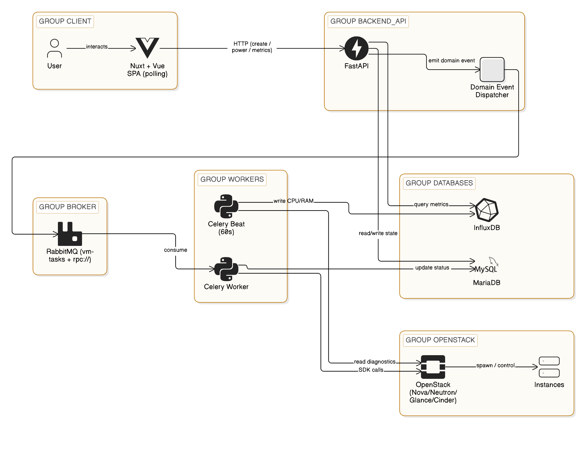

# VPS hosting platform

A VPS provisioning platform built on top of OpenStack. Users create virtual machines, networks, volumes, security groups, floating IPs and snapshots from a web UI.



## Overview

### Features

- **Compute** - create / delete / start / stop / reboot instances, live noVNC console
- **Networking** - VPC-style private networks and subnets, automatic router wiring, security groups, floating IPs
- **Storage** - block volumes (attach / detach), image import from URL, live snapshots
- **Access** - SSH keypair upload or in-browser generation
- **Presets** - one-click cloud-init templates (Ollama LLM server, WordPress, ...)
- **Observability** - live CPU charts, per-instance event log, admin dashboard of real cluster capacity
- **Multi-tenancy** - organizations with role-based access control (owner / member / admin) and resource quotas

### Design

The architecture follows one important rule: the API never talks to OpenStack directly.

- FastAPI only reads/writes its own database and emits *domain events*
- Celery workers own every OpenStack SDK call
- RabbitMQ carries the tasks between them
- a Celery Beat scheduler reconciles the database against OpenStack's real state every 30 s, meters usage and collects telemetry into InfluxDB


### How a VM gets created

1. The user submits the create form `POST /instances`.
2. FastAPI validates quota and permissions, writes an `Instance` row with status `BUILD`, emits a domain event and returns immediately.
3. The event handler enqueues a Celery task on RabbitMQ.
4. A worker boots the server via the OpenStack SDK, attaches volumes and assigns a floating IP, updating the database as each step completes.
5. The frontend polls the API and the status flips to `ACTIVE` - no page refresh needed.

## Running the project

> Requires a reachable **OpenStack** cloud (developed against an all-in-one Kolla-Ansible deployment). The supporting services ( MariaDB, RabbitMQ, InfluxDB) run locally via Docker Compose.

**Prerequisites:** Docker, Python 3.12+, Node.js 20+, OpenStack credentials.

### 1. Configuration

Create `backend/.env`:

```env
# MariaDB
DB_USER=vps_user
DB_PASS=vps_pass
DB_HOST=localhost
DB_PORT=3306
DB_NAME=vps_platform
ROOT_DB_PASS=changeme

# OpenStack
OS_AUTH_URL=http://<openstack-host>:5000/v3
OS_PROJECT_NAME=admin
OS_USERNAME=admin
OS_PASSWORD=<password>
OS_EXTERNAL_NETWORK=public1

# JWT
JWT_SECRET_KEY=secret

# InfluxDB
INFLUXDB_URL=http://localhost:8086
INFLUXDB_ADMIN_TOKEN=super-secret
INFLUXDB_ORG=vps_platform
INFLUXDB_BUCKET=telemetry
```

### 2. Infrastructure services

```sh
cd backend
docker compose up -d   # MariaDB, RabbitMQ, InfluxDB
```

### 3. Backend

Install dependencies:

```sh
cd backend
python -m venv .venv && source .venv/bin/activate
pip install -r requirements.txt
```

Then run these three processes, each in its own terminal:

```sh
uvicorn main:app --reload                                        # REST API
celery -A core.celery_app worker --loglevel=info --pool=solo     # OpenStack worker
celery -A core.celery_app beat --loglevel=info                   # reconciliation / metering
```

> `--pool=solo` is required on Windows; on Linux it can be dropped.

### 4. Frontend

```sh
cd frontend
npm install
npm run dev
```


## About this project

Developed as a final undergrad project.
